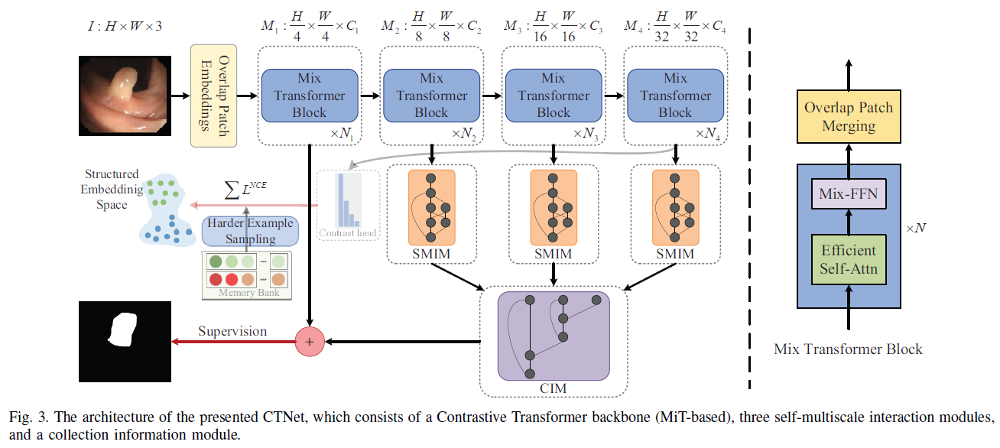
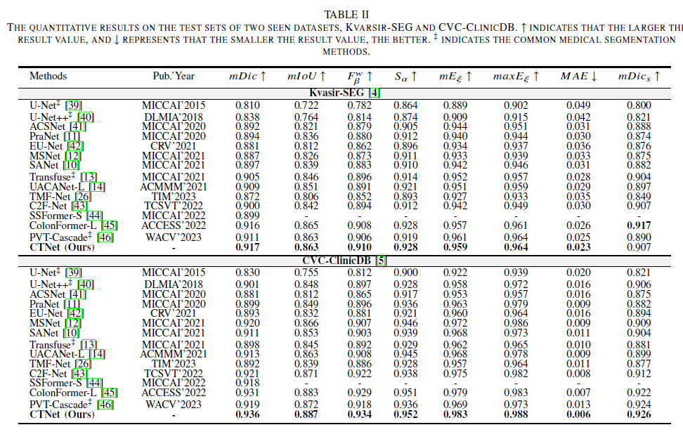
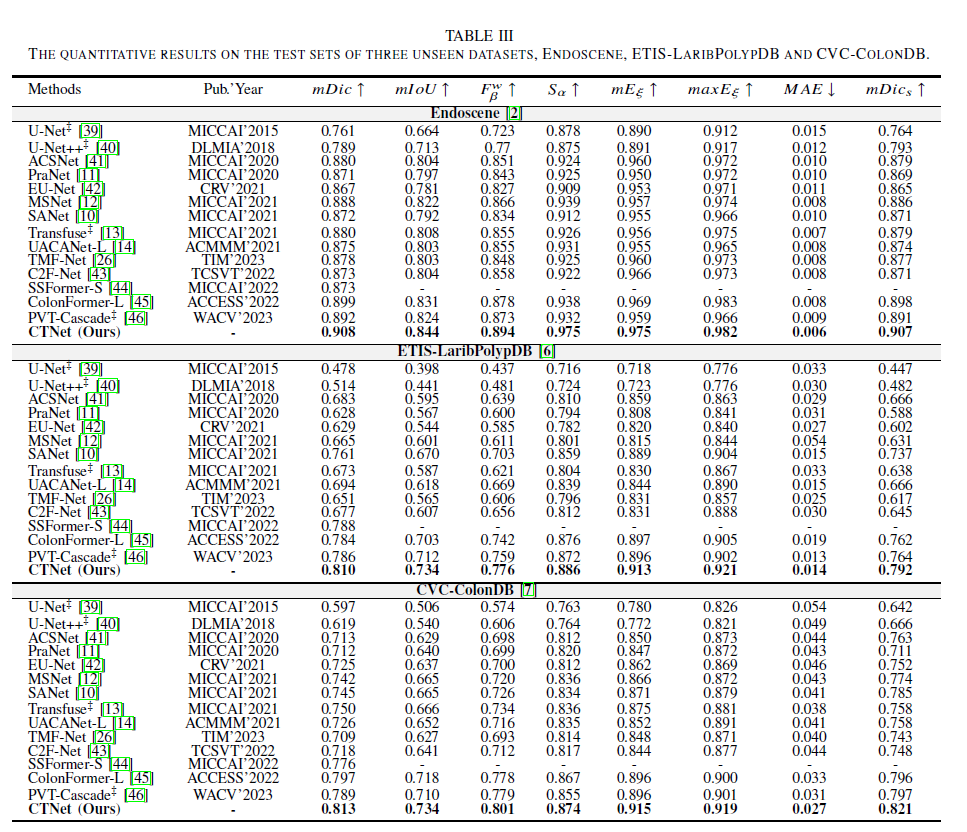
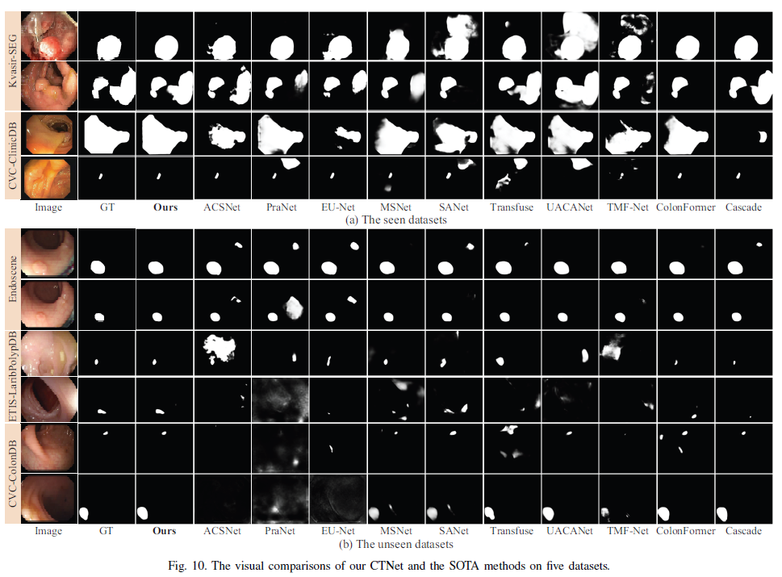

<h2 align="center">CTNet: Contrastive Transformer Network for Polyp Segmentation</h2>
<h4 align="right">by <a href="https://faculty.cqupt.edu.cn/xiaobin/zh_CN/index.htm">Bin Xiao</a>, <a href="https://fhujinwu.github.io/">Jinwu Hu</a>, <a href="https://scholar.google.com/citations?hl=en&user=M17E3HEAAAAJ">Weisheng Li</a>, <a href="https://scholar.google.com/citations?user=JTkP_EAAAAAJ&hl=en">Chi-Man Pun</a>, <a href="https://scholar.google.com/citations?hl=en&user=1Ezgfw8AAAAJ">Xiuli Bi *</a></h4>

<div align="center">
  <br><br>
</div>
<div align="center">
  <br><br>
</div>
<div align="center">
  <br><br>
</div>
<div align="center">
  <br><br>
</div>

This is an official implementation of CTNet in our IEEE Transactions on Cybernetics paper "
<a href="https://ieeexplore.ieee.org/document/10471227">
CTNet: Contrastive Transformer Network for Polyp Segmentation</a>"

## Note
* Our code is based on the <a href="https://github.com/DengPingFan/PraNet">PraNet</a>, <a href="https://github.com/tfzhou/ContrastiveSeg">ContrastiveSeg</a>, <a href="https://github.com/PaddlePaddle/PaddleSeg">PaddleSeg</a> implementation.
* result_map.zip is the test result of CTNet.


## Citation
If you use CTNet in your research, please cite our IEEE Transactions on Cybernetics paper.

```text
@ARTICLE{10471227,
  author={Xiao, Bin and Hu, Jinwu and Li, Weisheng and Pun, Chi-Man and Bi, Xiuli},
  journal={IEEE Transactions on Cybernetics}, 
  title={CTNet: Contrastive Transformer Network for Polyp Segmentation}, 
  year={2024},
  volume={},
  number={},
  pages={1-14},
  doi={10.1109/TCYB.2024.3368154}}

```
 
## update status
The code (V2.0) is uploaded (Ongoing updates).
